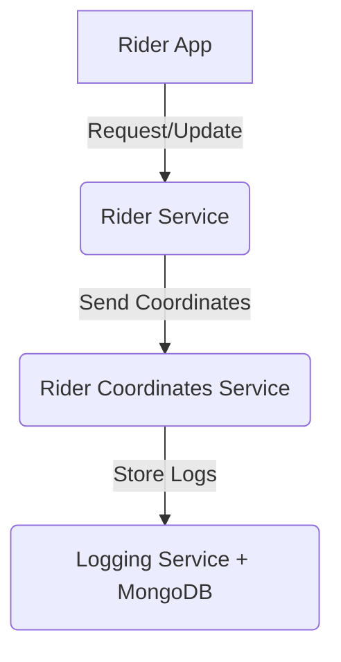

Perfect! Here’s a polished **GitHub-ready README** with badges, your microservices explanation, and styling:

---

# 🚖 Uber-like Microservices Project


This project is a **backend system for a ride-hailing application** built using a **microservices architecture** with **NestJS**. Each service is isolated and communicates via **NestJS Microservices (TCP transport)**.

---

## 📌 Overview

The system consists of multiple services, each responsible for a specific domain:

* **Rider Service** 🏍️ – Handles rider registration, profile, and availability.
* **Logging Service** 📝 – Responsible for storing and retrieving logs of rider coordinates.
* **Rider Coordinates Service** 📍 – Manages real-time rider location tracking.

Services communicate using **NestJS TCP-based microservices** for high performance and scalability. Data is stored in **MongoDB**.

---

## 🛠️ Tech Stack

* **Backend Framework**: [NestJS](https://nestjs.com/) (TypeScript)
* **Database**: MongoDB with [Mongoose ODM](https://mongoosejs.com/)
* **Communication**: NestJS Microservices (TCP transport)
* **Language**: TypeScript
* **Package Manager**: npm

---

## 🏗️ Microservices

### 1. Rider Service 🏍️

* **Port**: `4002`
* Manages rider data (registration, profile, service requests).
* Exposes microservice endpoints for other services to consume.

### 2. Logging Service 📝

* **Port**: `4001`
* Stores logs in **MongoDB** (`logs_db`).
* Uses Mongoose schema for structured storage.
* Consumes events from the Rider Coordinates Service.

### 3. Rider Coordinates Service 📍

* Embedded in Logging Service module.
* Tracks rider GPS coordinates in real-time.
* Publishes location updates to Logging Service.

---

## ⚙️ Setup Instructions

### 1. Clone the Repository

```bash
git clone https://github.com/your-username/uber-microservices.git
cd uber-microservices
```

### 2. Install Dependencies

```bash
npm install
```

### 3. Start MongoDB

Make sure MongoDB is running locally with authentication:

```bash
docker run -d \
  --name mongo \
  -e MONGO_INITDB_ROOT_USERNAME=root \
  -e MONGO_INITDB_ROOT_PASSWORD=root \
  -p 27017:27017 \
  mongo
```

### 4. Run Microservices

#### Rider Service

```bash
npm run start rider-service
```

#### Logging Service (includes Rider Coordinates Module)

```bash
npm run start logging-service
```

---

## 🔗 Communication Flow



* Rider App interacts with **Rider Service**.
* Rider Service publishes **coordinates updates** to Rider Coordinates.
* Rider Coordinates pushes logs to **Logging Service** which persists them in **MongoDB**.

---

## 📂 Project Structure

```
apps/
├── rider-service/
│   ├── src/
│   │   ├── rider-service.controller.ts
│   │   ├── rider-service.service.ts
│   │   └── main.ts
├── logging-service/
│   ├── rider-coordinates/
│   │   ├── rider-coordinates.controller.ts
│   │   ├── rider-coordinates.service.ts
│   │   ├── rider-coordinates.module.ts
│   │   └── schemas/
│   │       └── rider-coordinates.schema.ts
│   └── src/
│       ├── logging-service.controller.ts
│       ├── logging-service.service.ts
│       └── logging-service.module.ts
```

---

## 🚀 Future Improvements

* Add **Passenger Service** for ride requests.
* Integrate **Kafka or RabbitMQ** for event-driven communication.
* Implement **JWT-based authentication**.
* Deploy with **Docker + Kubernetes**.

---

## 📜 License

MIT License © 2025

---

If you want, I can also **add a section with curl/Postman examples** showing how to **POST coordinates and GET rider info** so that someone can test the microservices right away.

Do you want me to do that?
